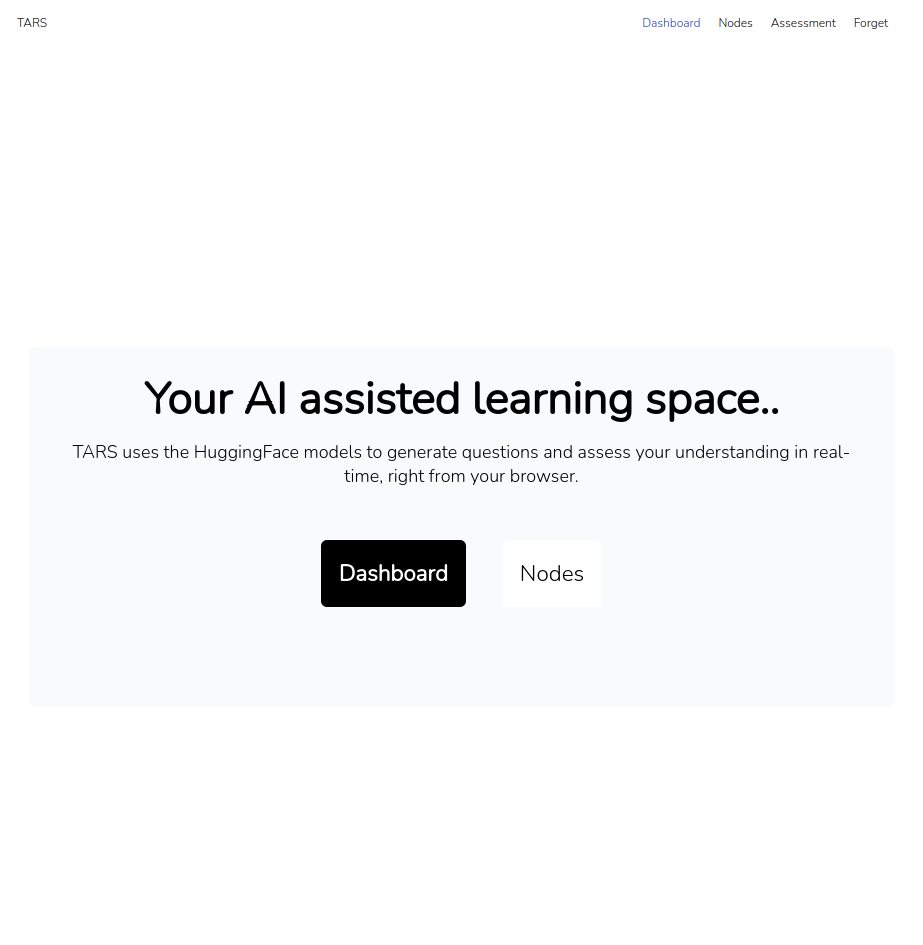
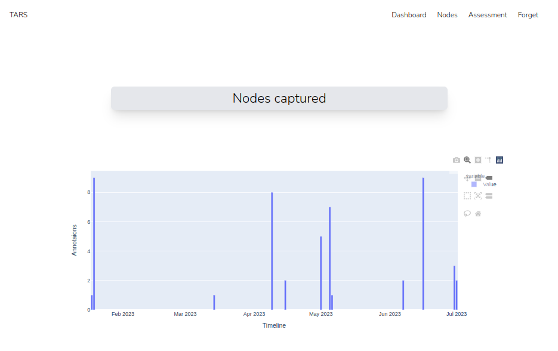
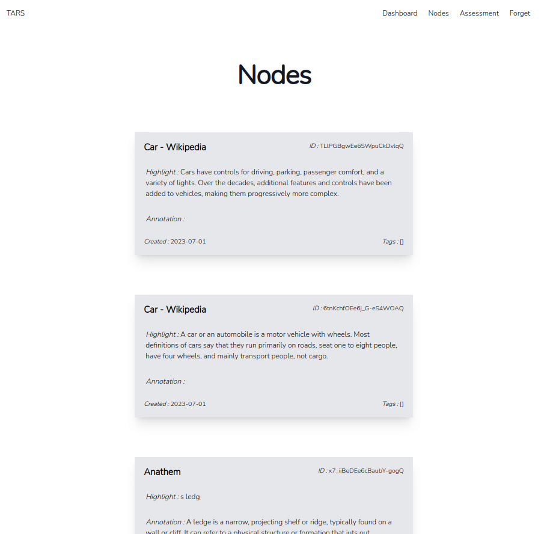
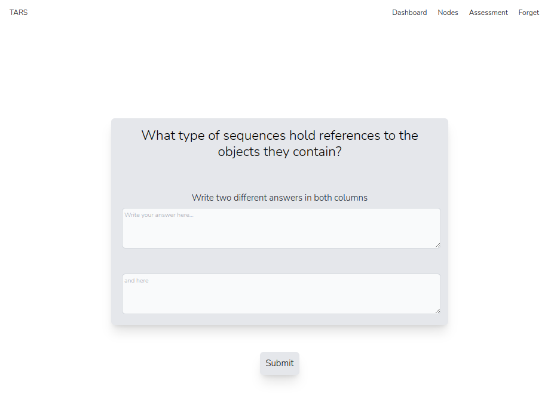

<p align="center">
  <b> ~ TARS ~ </b>
</p>
<div align="center">
    <p></p>
    <a href="https://github.com/thlurte/dots/stargazers">
        
    </a>
        
    </a>
</div>
<div>

 </div>


<br/>
<p align="center"> a personal learning space with flask and hypothesis.io  </p>
<br/>

## Features

### Dashboard
- plotly for visualizing the data related to the nodes captured and questions answered.


### Nodes
- annotations(nodes) captured from Hypothesis.io are stored in MongoDB local database


### Assessment
- HuggingFace api's to generate questions and assess answers based on the node.



## Installation

### Dependancies

```bash
pip install virtualenv
```

- [MongoDB Community Edition](https://www.mongodb.com/docs/manual/tutorial/install-mongodb-on-windows/)
- [virtualenv](https://pypi.org/project/virtualenv/)

### Process

Clone the repo into a prefered directory.
```bash
git clone git@github.com:Thlurte/TARS.git
```
cd into the repo
```
cd TARS/
```
activate  virtual environment
```
source venv/bin/activate
```
run the application
```
flask --app main run
```
## Credits
- [mrm8488/t5-base-finetuned-question-generation-ap](https://huggingface.co/mrm8488/t5-base-finetuned-question-generation-ap)
- [sentence-transformers/paraphrase-multilingual-MiniLM-L12-v2](https://huggingface.co/sentence-transformers/paraphrase-multilingual-MiniLM-L12-v2)


